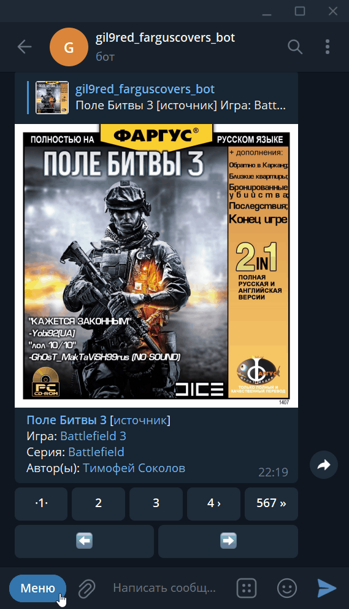
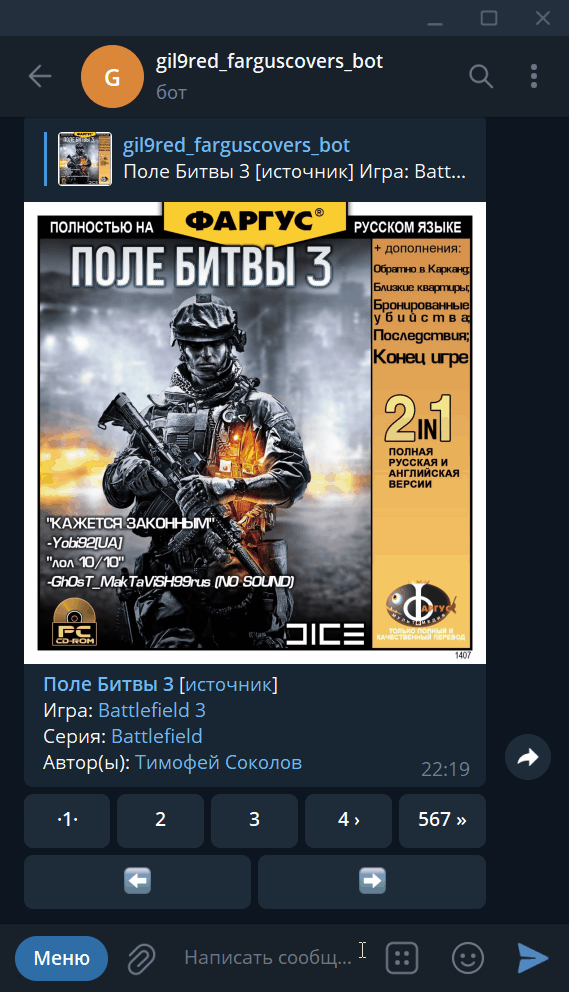

# farguscovers_bot
Бот для показа обложек из постов группы https://vk.com/farguscovers

# Скриншоты:
## Обложки:

## Меню:

## Управление через кнопки:

## Работа со ссылками:
Используется для перехода к объектам через ссылки на самого бота (deep-linking), что работает через команду /start, поэтому нужно в боте после клика на ссылку кликнуть на появившуюся кнопку внизу   

## Работа со ссылками на **\[источник]**:
Так называются ссылки на внешние источники 

# Etc

[Картинки и дамп получены отсюда](https://github.com/gil9red/SimplePyScripts/tree/e1334355ba8ee89713a840ea6adf2beb9e5a78c5/vk_api__examples/download_covers_from_farguscovers__wall_get)
